

  <h1>💳 Credit Card Clustering & Segmentation</h1>
  
<b>Transformando Dados Transacionais em Personas Acionáveis usando Machine Learning Não Supervisionado e Explainable AI</b>

  
  
   
  
  
  
  
  

 

## 📖 O Projeto: O "Porquê" e o "Para Quê"

Empresas financeiras e administradoras de cartão de crédito gerenciam bases colossais de clientes com hábitos de consumo incrivelmente distintos. O objetivo central deste projeto foi desenvolver um pipeline inteligente de agrupamento (**Clustering**) para segmentar esses clientes. 

As aplicações de negócio (o "para quê") são diretas e impactantes:
1. **Entender o Perfil de Consumo:** Diferenciar o cliente que usa o cartão para compras diárias do cliente que o usa como linha de crédito de emergência.
2. **Gestão de Risco Inteligente:** Identificar grupos específicos com alta utilização de limite, porém baixas taxas de pagamento (maior risco de inadimplência).
3. **Estratégias de Marketing Personalizadas:** Adequar a comunicação, ofertas de aumento de limite e programas de pontos à necessidade real de cada segmento.

Este repositório documenta a evolução da análise de ponta a ponta, começando pela limpeza e validação estatística dos dados brutos, passando pelo treinamento de Inteligência Artificial e culminando em insights acionáveis prontos para produção.

---

## 🔎 1. Limpeza de Dados e Testes de Hipóteses

Antes de aplicar qualquer algoritmo avançado, foi fundamental compreender o comportamento oculto nos dados. Realizamos testes estatísticos para validar algumas crenças comuns do mercado financeiro e garantir que nossas premissas faziam sentido. Foram testadas três grandes hipóteses:

* 📊 **Hipótese 1: Pagamento Integral vs. Limite de Crédito**  
  Buscamos entender se o limite de crédito fornecido é influenciado pelo fato de o cliente quitar a fatura.
  * **$H_0$ (Nula):** A média do limite de crédito dos clientes que pagam a maior parte da fatura é igual à dos que pagam o mínimo.
  * **$H_1$ (Alternativa):** Existe uma diferença significativa na média do limite de crédito entre esses dois grupos.
  
  Ao aplicar o teste estatístico, encontramos a distribuição abaixo, confirmando que o perfil de pagamento afeta o limite concedido.
   
  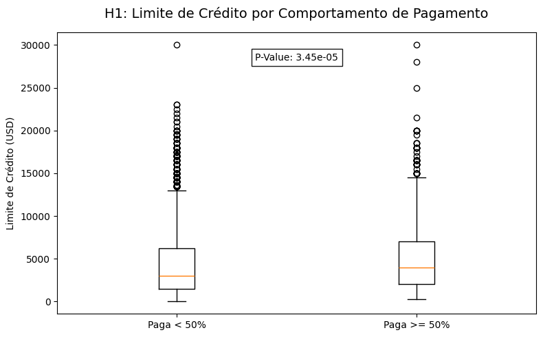

* 💸 **Hipótese 2: Saque Emergencial vs. Volume de Compras**  
  Investigamos se o cliente que saca dinheiro no cartão (Cash Advance) também é um comprador ativo no dia a dia.
  * **$H_0$ (Nula):** Clientes que fazem saque em dinheiro gastam em compras no cartão a mesma quantia média que os clientes que não fazem saque.
  * **$H_1$ (Alternativa):** Existe uma diferença significativa no volume médio de compras entre quem faz e quem não faz saque.
  
  Os dados revelaram a real diferença de volume transacional entre esses perfis.
   
  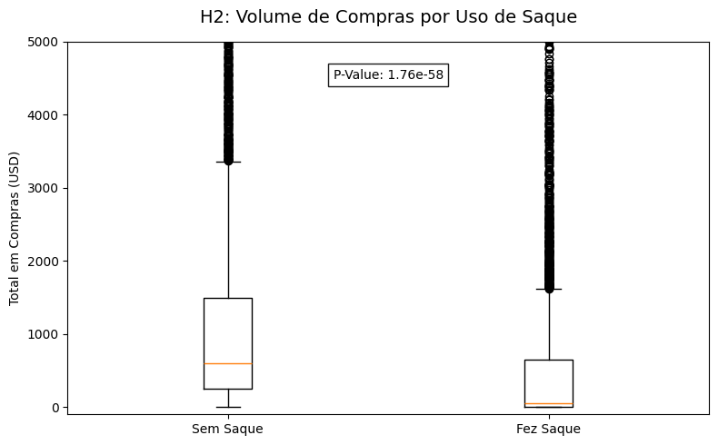

* ⏳ **Hipótese 3: Fidelidade (Tempo de Conta) vs. Saldo Devedor**  
  Finalmente, avaliamos o peso da idade da conta no acúmulo de saldo devedor.
  * **$H_0$ (Nula):** O saldo devedor médio dos clientes mais antigos (12 meses) é igual ao dos clientes mais recentes (< 12 meses).
  * **$H_1$ (Alternativa):** Existe uma diferença significativa no saldo devedor médio com base na fidelidade do cliente.
  
  Comprovamos estatisticamente que a lealdade afeta diretamente o acúmulo de balanço.
   
  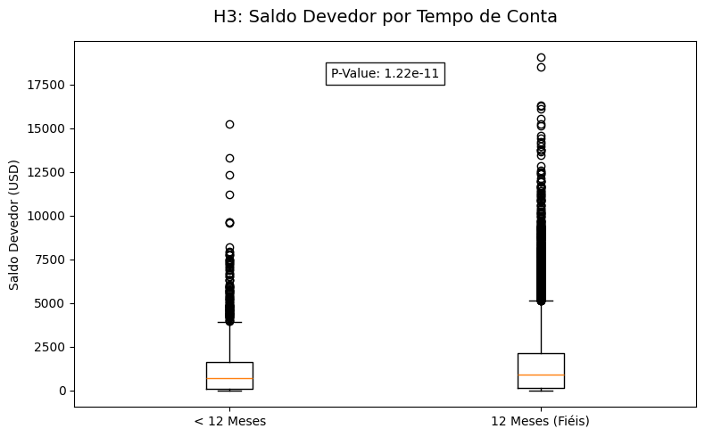

---

## 🛠 2. Feature Engineering e Tratamento de Colinearidade

Ao lidar com algoritmos de clusterização que dependem do cálculo espacial entre variáveis (como o KMeans), **colinearidade** (variáveis que medem a mesma coisa) pode distorcer severamente os agrupamentos. O modelo acabaria dando um "peso duplo" para comportamentos redundantes.

Para combater isso, geramos Matrizes de Correlação e analisamos a relação cruzada de todos os atributos financeiros. Identificamos as redundâncias e removemos variáveis sobrepostas para manter o sinal limpo e evitar viés.

Abaixo, a evolução visual que comprova a limpeza das correlações perfeitas ao longo do refinamento do conjunto de dados, demonstrando o cuidado antes de seguir para a modelagem:

  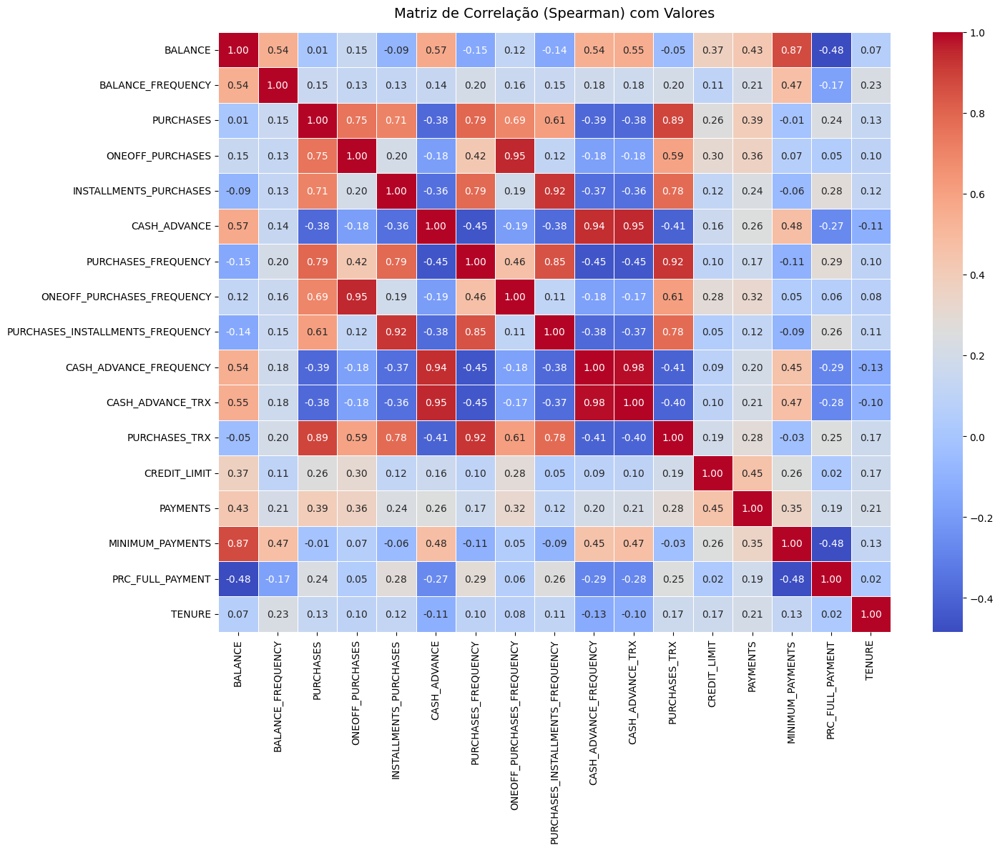
  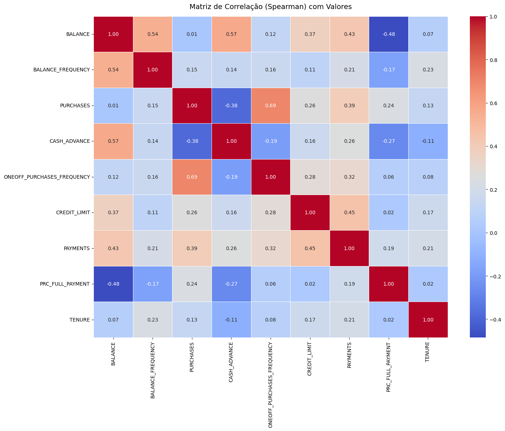

  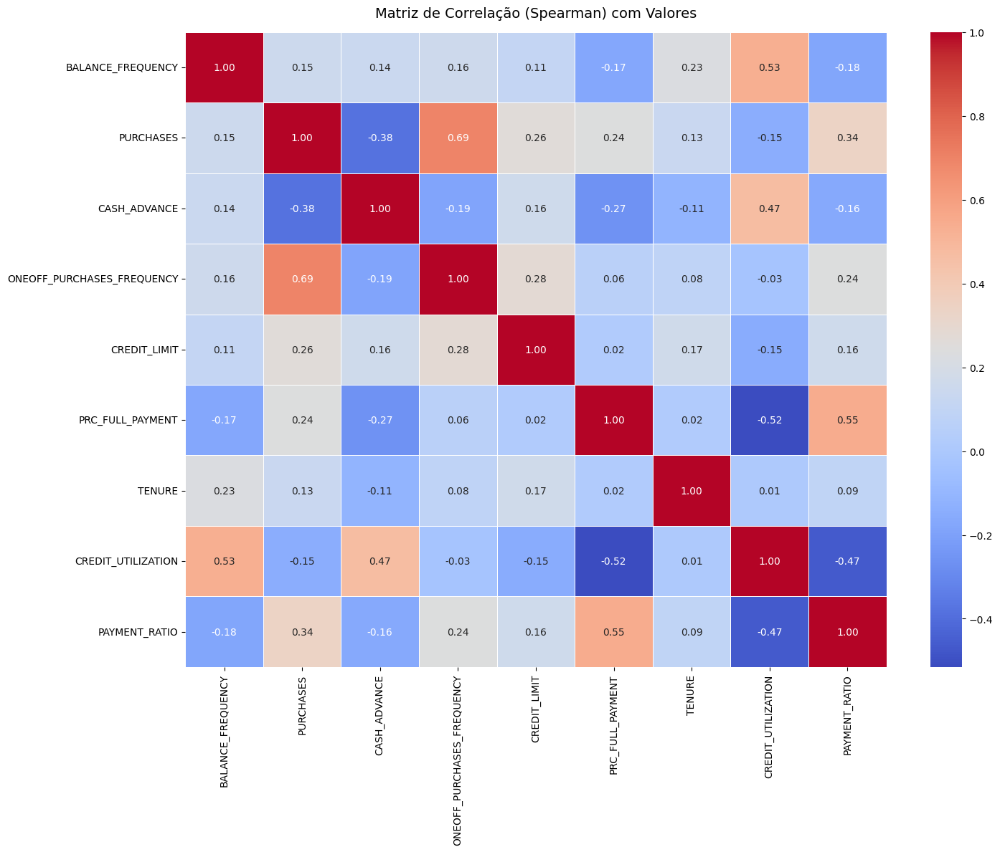

Após isolar apenas as variáveis de impacto, a base foi devidamente dividida (Treino, Validação e Teste) e escalonada para uniformizar a grandeza financeira e percentual de todos os clientes.

---

## 🤖 3. Modelagem de Machine Learning e Decisões Arquiteturais

Não assumimos o algoritmo ou o número ideal de perfis de forma arbitrária. A decisão foi puramente matemática.

1. **Quantos agrupamentos existem na realidade? (Elbow Method & Silhouette Score)** 
   Para identificar quantos tipos diferentes de consumidores a base de dados abrigava, calculamos a inércia (Elbow Method) e validamos a densidade usando o Silhouette Score. O gráfico gerado abaixo provou matematicamente que após a quebra no **K=6**, o modelo parava de encontrar novos grupos úteis e apenas fragmentava o que já existia.
    
   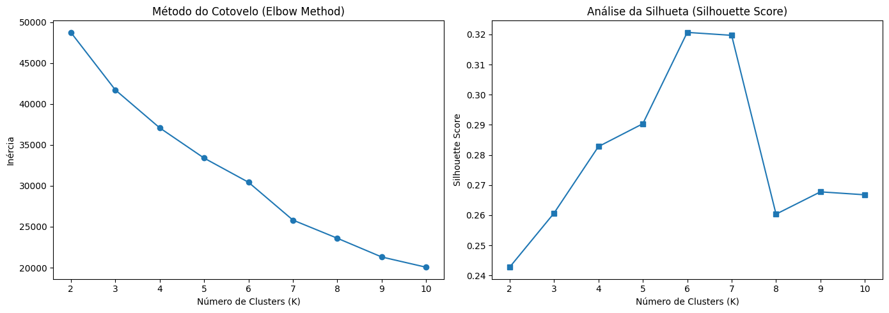

2. **Batalha de Algoritmos e Otimização:** 
   Avaliamos `K-Means`, `Clustering Hierárquico` e `DBSCAN`. O modelo que melhor se adequou à distribuição geométrica dos clientes foi o K-Means. Para fugir de parâmetros genéricos, executamos uma varredura otimizada por **Optuna**, testando combinações iterativamente. O melhor resultado elevou a pureza dos nossos agrupamentos (Silhouette Score final na Validação: 0.3242).
    
   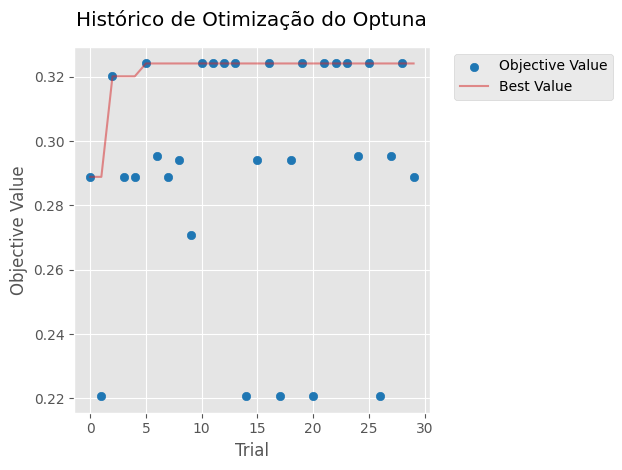

Com o modelo finalmente estabilizado, geramos a visualização espacial abaixo, onde cada ponto representa um consumidor real, já separado em seu respectivo agrupamento financeiro (cluster):
 
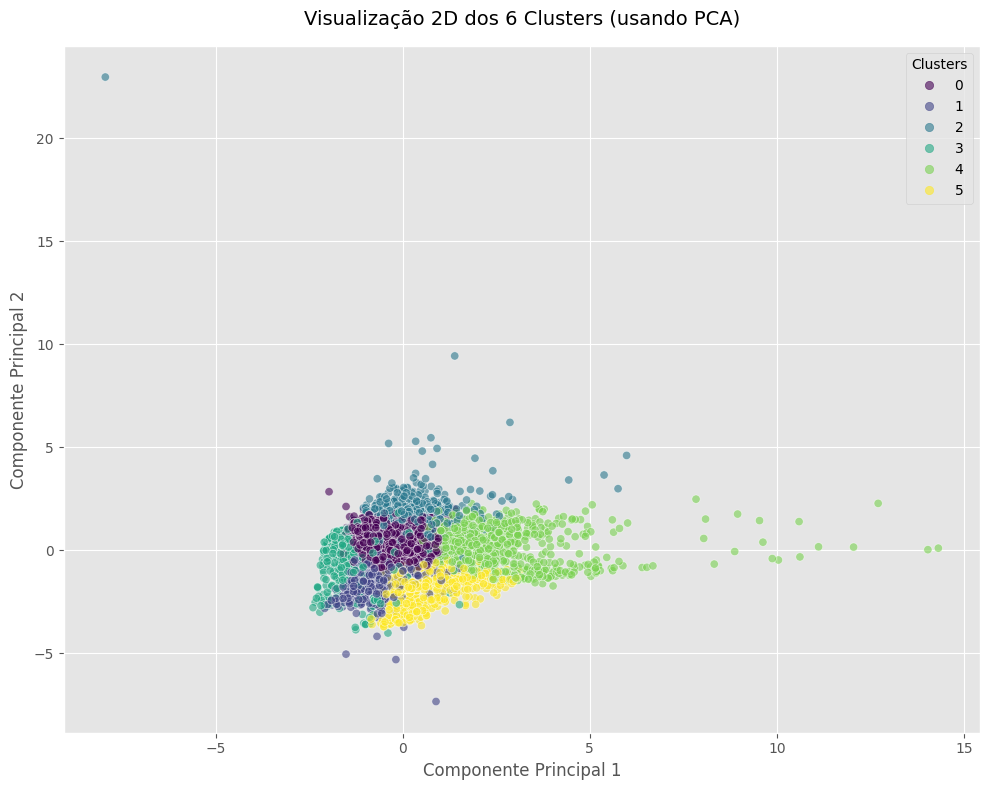

---

## 🎯 4. Prova Real: Validando os Agrupamentos

Um dos grandes desafios do Aprendizado Não Supervisionado é provar que os clusters encontrados não são "alucinações" do algoritmo. Como ter certeza de que esses 6 perfis gerados possuem uma lógica real de comportamento financeiro?

Desenvolvemos um "juiz" para o modelo: pegamos os dados reais dos clientes e pedimos a um **Random Forest** (algoritmo supervisionado) que adivinhasse em qual cluster aquele cliente se encaixava.
O resultado foi incontestável: o classificador atingiu impressionantes **97% de precisão** nos dados de teste. 

Ao plotar a **Matriz de Confusão** do classificador, notamos que a densidade de acertos ficou totalmente concentrada na diagonal principal. Isso significa que o K-Means não juntou clientes ao acaso; ele aprendeu regras claras (limite, compras, pagamentos) que são perfeitamente mapeáveis por outros modelos preditivos.
 
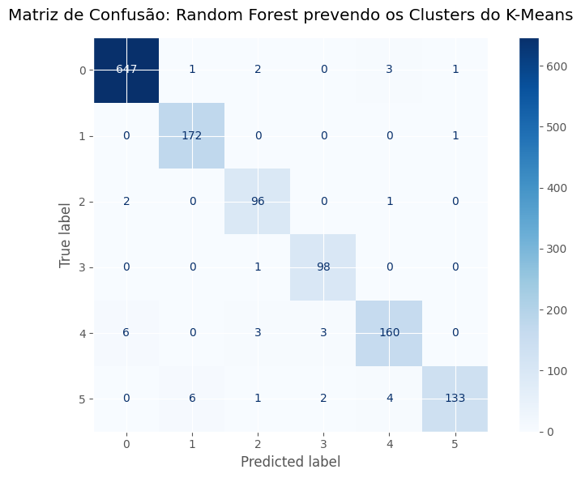

---

## 🎭 5. Personas e Mapeamento Causal com Explainable AI (SHAP)

Temos 6 clusters, mas o que significa pertencer ao Grupo 1 em vez do Grupo 5? Para traduzir matemática em **estratégia de negócios**, utilizamos **SHAP (SHapley Additive exPlanations)**. O SHAP abriu a "caixa preta" do modelo e nos contou exatamente qual atitude financeira pesava mais para arrastar um cliente até um cluster específico.

O gráfico de impacto global ilustrou o campo de batalha de features, mostrando quem domina os agrupamentos:
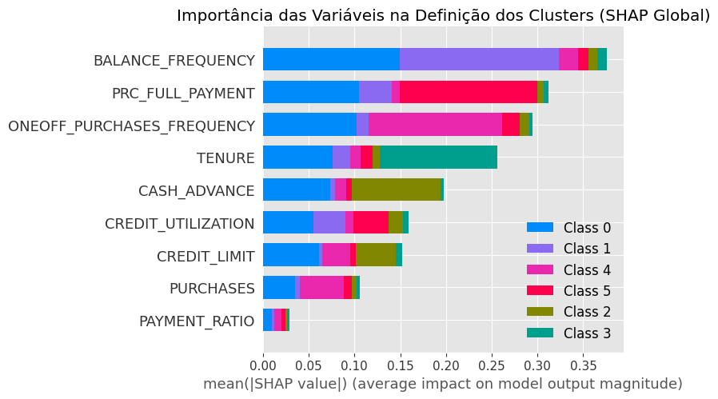

A partir dessa mineração profunda de influência causal, desenhamos e consolidamos em tabela as **6 Personas** definitivas da operadora de cartão:

| Cluster | Nome da Persona | Perfil de Comportamento Extraído dos Dados |
| :---: | :--- | :--- |
| **0** | **Consumidor Equilibrado** | Um grupo de perfil misto, cujo comportamento é moldado pela combinação de manter saldo frequente, fazer pagamentos integrais e realizar compras à vista. |
| **1** | **Cliente do Rotativo** | Clientes definidos quase que inteiramente pela frequência com que deixam saldo rotativo acumulado no cartão. |
| **2** | **Sacador de Emergência** | O grupo focado em liquidez de emergência, caracterizado fortemente pelo uso do limite de crédito para saques em dinheiro vivo. |
| **3** | **Cliente Veterano** | Clientes cujo diferencial e principal critério de agrupamento é uma extrema fidelidade, ditada pelo tempo de relacionamento e idade da conta. |
| **4** | **Comprador Ativo** | Consumidores altamente ativos, definidos pelo grande volume financeiro e alta frequência de compras no dia a dia em parcela única. |
| **5** | **Pagador Integral** | Os típicos "bons pagadores", isolados de todo o resto pela sua consistência inabalável em sempre quitar 100% do valor total da fatura. |

Abaixo exploramos a explicação visual individual gerada pelo SHAP para cada persona, validando matematicamente os perfis descritos na tabela acima:

### Cluster 0: Consumidor Equilibrado
O comportamento é liderado pela balança entre atualizar o saldo e realizar compras (Balance Frequency vs One-off Purchases).
 
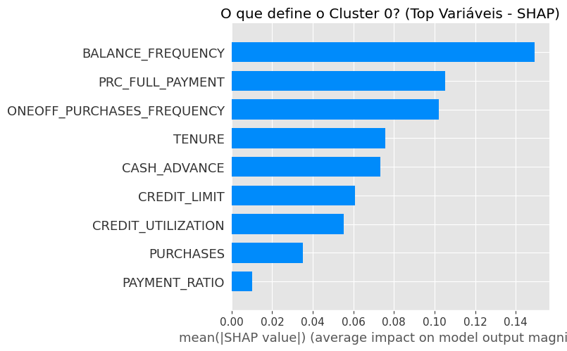

### Cluster 1: Cliente do Rotativo
No gráfico SHAP deste cluster, nota-se o domínio massivo de uma única variável: a manutenção recorrente do saldo na conta (Balance Frequency).
 
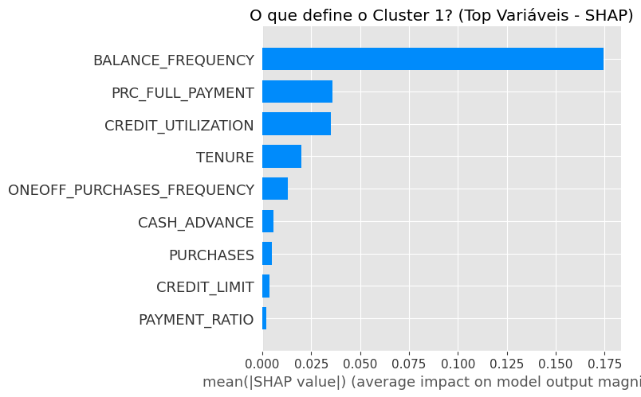

### Cluster 2: Sacador de Emergência
Aqui a inteligência explicável provou seu valor ao revelar que `Cash Advance` é a métrica onipotente, anulando compras tradicionais.
 
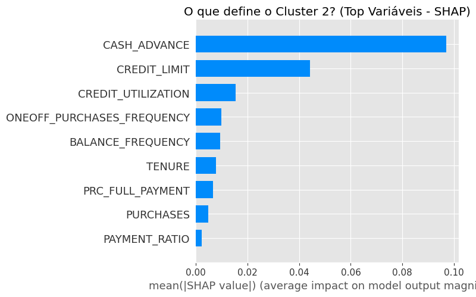

### Cluster 3: Cliente Veterano
A variável `Tenure` salta no SHAP, indicando que o modelo priorizou isolar as contas mais maduras da base histórica.
 
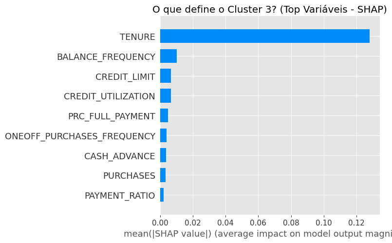

### Cluster 4: Comprador Ativo
A explicação visual mostra que esse perfil é completamente impulsionado pelo hábito de gastar muito em compras frequentes, ignorando as opções de saque.
 
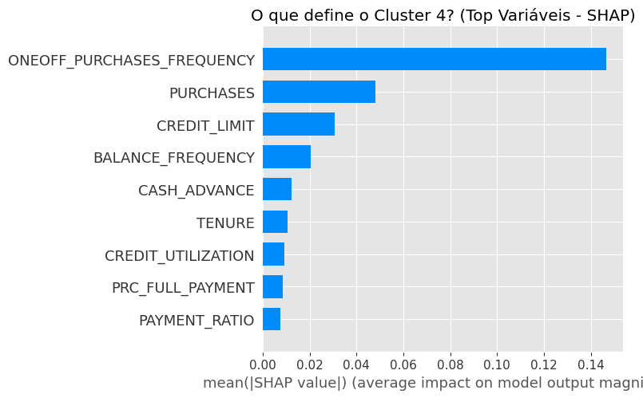

### Cluster 5: Pagador Integral
O gráfico revela o impacto avassalador da métrica `PRC_FULL_PAYMENT` (Percentual de Pagamento Total). Eles fogem de dívidas.
 
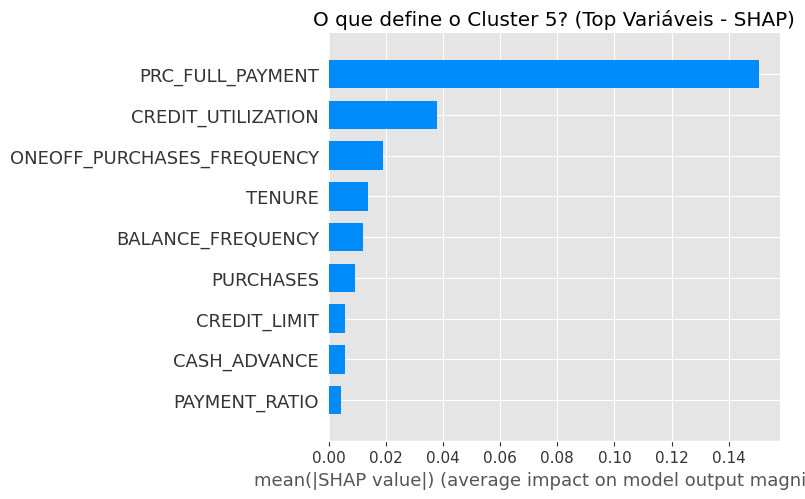

---

## 🚀 6. Considerações Finais e Deploy de Negócio

Esta jornada deixou claro que tratar uma base de milhões de cartões como uma "massa uniforme" significa perder grandes oportunidades de rentabilidade e retenção. Ao identificar e compreender os motores internos de decisão de 6 públicos totalmente diferentes, o time de negócios ganha poder de agir.

### Preparação para Produção
O modelo não ficou no campo teórico. Encapsulamos os objetos do pipeline de clusterização, salvando o modelo treinado e o pré-processador de escalas como arquivos seriais práticos (`.joblib`). O fluxo culmina em uma demonstração de ponta a ponta que recebe a matriz de hábitos de um cliente fictício, normaliza os valores na mesma grandeza do modelo treinado, e retorna instantaneamente qual das **6 personas** ele pertence (Inferência em Produção).

### Próximos Passos Sugeridos
- **Marketing Direcionado**: Enviar propagandas de parcelamento vantajoso apenas para o *Comprador Ativo*, e isenções para o *Cliente Veterano*.
- **Alerta Anti-Risco (Migração de Cluster)**: Criar um rastreador periódico que dispare um alerta para o time de análise sempre que um *Pagador Integral* subitamente passar a apresentar métricas de um *Sacador de Emergência* — um grande indicativo de crise financeira ou futuro calote.

 

**Dataset Origem:** [Credit Card Dataset for Clustering (Kaggle)](https://www.kaggle.com/datasets/arjunbhasin2013/ccdata)

 

**Autor do Projeto:** [Yan Enrique (OYanEnrique)](https://github.com/OYanEnrique)  
*(Cientista de Dados | Machine Learning Engineer)*

---

## 📝 Licença

Este projeto está sob a licença **MIT**. Veja o arquivo [LICENSE](LICENSE) para mais detalhes.
